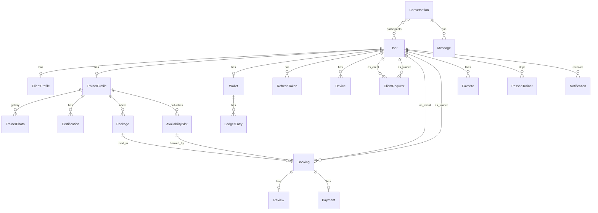

# Data model

PostgreSQL via Prisma. One `User` row per account. Role-specific data lives on `ClientProfile` or `TrainerProfile`.

## ER (logical)

## Tables (MVP)

### users
id, role, email (unique), phone, passwordHash, fullName, avatarUrl, emailVerifiedAt, onboardingStep, onboardingCompletedAt, status (`ACTIVE` | `DISABLED` | `DELETED`), lastSeenAt, createdAt, updatedAt

### client_profiles
userId (pk/fk), gender, dateOfBirth (or age stored + birth year), weightKg, heightCm, experienceLevel, frequency, coachStyle, preferredLanguage, trainerGenderPref, goals[] , trainLocations[] , specialNeeds[], addressText, lat, lng

### trainer_profiles
userId, gender, headline, bio, experienceBand, sessionsPerWeek, rateBand, baseRateCents, coachStyle, languages[], specializations[], trainLocations[], avgRating, reviewCount, sessionCount, clientCount, addressText, lat, lng

### certifications
id, trainerId, fileUrl, title, status (`PENDING` | `APPROVED` | `REJECTED`)

### trainer_photos
id, trainerId, url, sortOrder

### packages
id, trainerId, type (`PER_SESSION` | `DAILY` | `WEEKLY` | `MONTHLY`), title, sessionCount, pricePerSessionCents, isActive

### availability_slots
id, trainerId, packageId (nullable), startsAt, endsAt, serviceType (`IN_GYM` | `ONLINE` | `CLIENT_HOME`), locationText, status (`OPEN` | `HELD` | `BOOKED` | `CANCELLED`), spots (default 1)

### client_requests
id, clientId, trainerId, source (`MATCH` | `PROFILE` | `RENEW`), status (`NEW` | `ACCEPTED` | `DECLINED` | `ARCHIVED`), note, createdAt, respondedAt

### bookings
id, clientId, trainerId, slotId, packageId, status, locationText, startsAt, endsAt, clientPayCents, trainerEarnCents, platformFeeCents, cancelReason, createdAt

### reviews
id, bookingId (unique), authorId, targetId, rating (1–5), body, createdAt

### favorites / passed_trainers
clientId, trainerId, createdAt — unique pair

### conversations
id, createdAt, lastMessageAt

### conversation_participants
conversationId, userId, unreadCount, mutedUntil, lastReadAt

### messages
id, conversationId, senderId, type (`TEXT` | `IMAGE` | `SYSTEM`), body, mediaUrl, createdAt, deletedAt

### blocks / reports
blockerId, blockedId; reporterId, targetId, reason, createdAt

### notifications
id, userId, type, title, body, data json, readAt, createdAt

### wallets
userId, availableCents, pendingCents

### ledger_entries
id, walletId, bookingId nullable, type (`EARNING` | `FEE` | `WITHDRAWAL` | `REFUND` | `ADJUSTMENT`), amountCents, status (`PENDING` | `AVAILABLE` | `PAID` | `FAILED`), createdAt

### payments
id, bookingId, provider (`STRIPE`), providerRef, amountCents, status (`REQUIRES_CAPTURE` | `CAPTURED` | `CANCELLED` | `REFUNDED`)

### refresh_tokens
id, userId, hashedToken, expiresAt, revokedAt, userAgent

### devices
id, userId, pushToken, platform (`IOS` | `ANDROID`)

## Money

Store **integer cents**. Never floats.

## Soft rules

- Deleted users: `status = DELETED`, anonymize email, keep booking history.
- Trainer public profile is `trainer_profiles` + `users.fullName/avatar`.
- Chat allowed if: accepted request **or** any non-declined booking between the pair.
