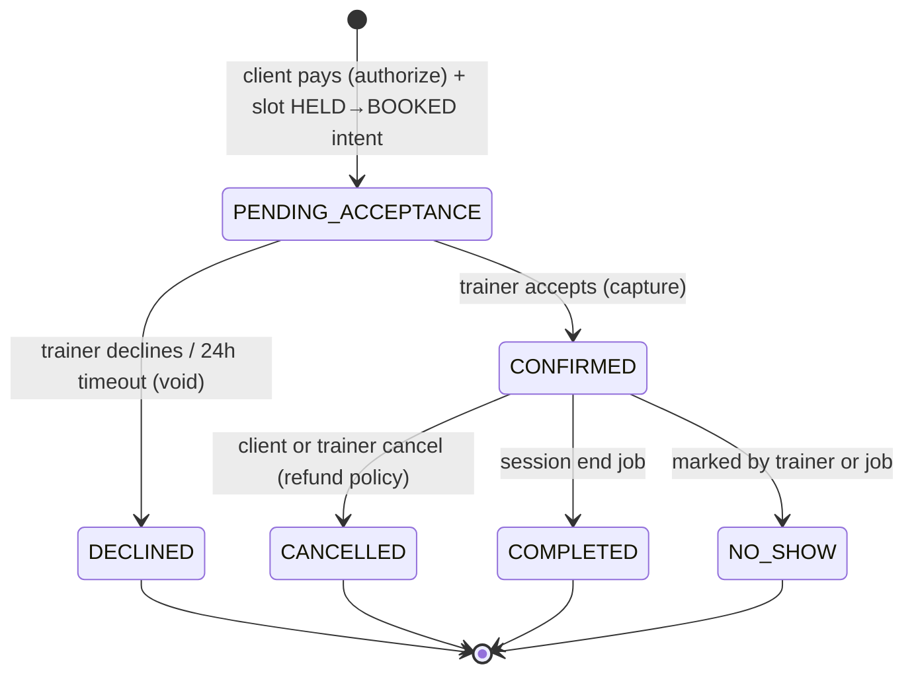
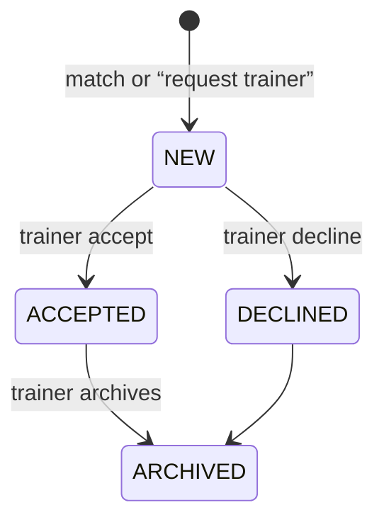

# State machines

## Booking



Rules:

- Creating a booking sets slot to `HELD` then `BOOKED` once payment authorizes.
- Decline/timeout: slot returns to `OPEN`.
- Reschedule: cancel old booking (policy) + create new one on another `OPEN` slot. MVP: only if status is `CONFIRMED` and startsAt > now + 12h.
- Review: only `COMPLETED`, one review per booking, client → trainer in MVP.

## Client request



`RENEW` filter = new request where client already had an accepted relationship before.

## Slot

```
OPEN → HELD (checkout started)
HELD → OPEN (checkout expired / failed)
HELD → BOOKED (payment authorized)
BOOKED → OPEN (booking declined or cancelled)
OPEN → CANCELLED (trainer removes slot)
```

## Payment vs wallet

- Authorize: `payments.status = REQUIRES_CAPTURE`; trainer `pendingCents += trainerEarn`
- Capture on accept: payment `CAPTURED`; ledger `PENDING → AVAILABLE` after session **or** immediately on accept for MVP (choose **available after COMPLETED** so refunds are simple)
- **MVP ledger:** pending on accept, available when booking `COMPLETED`

## User onboarding

`onboardingStep` is an integer. `onboardingCompletedAt` set on last step. Incomplete users can login but Discover/Schedule return `403 ONBOARDING_INCOMPLETE` except profile/onboarding routes.
