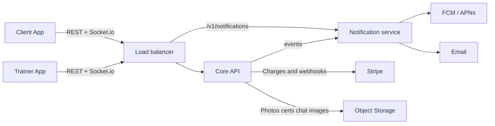
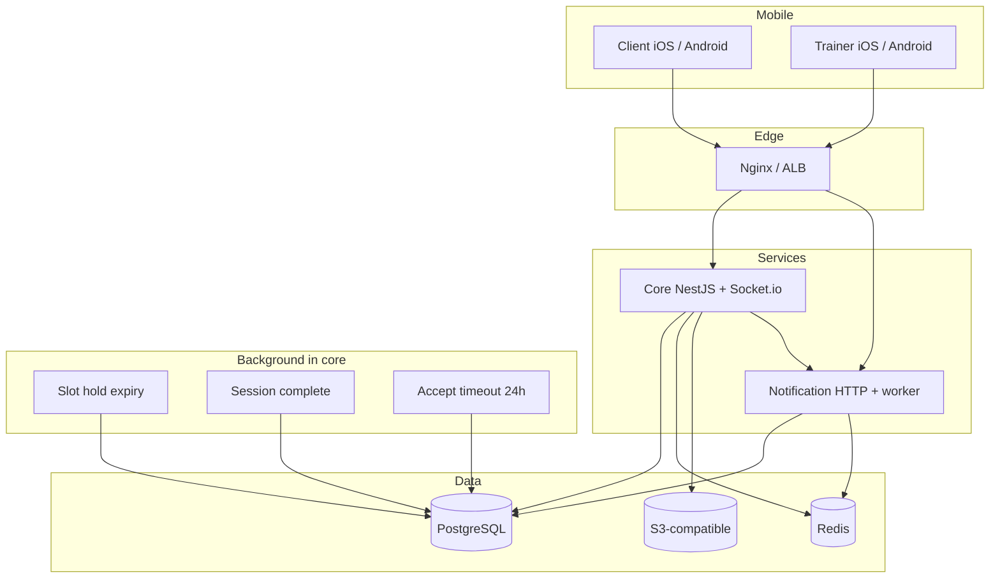
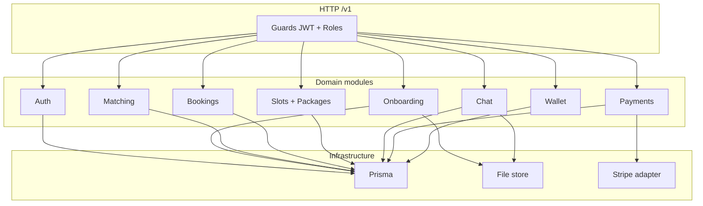
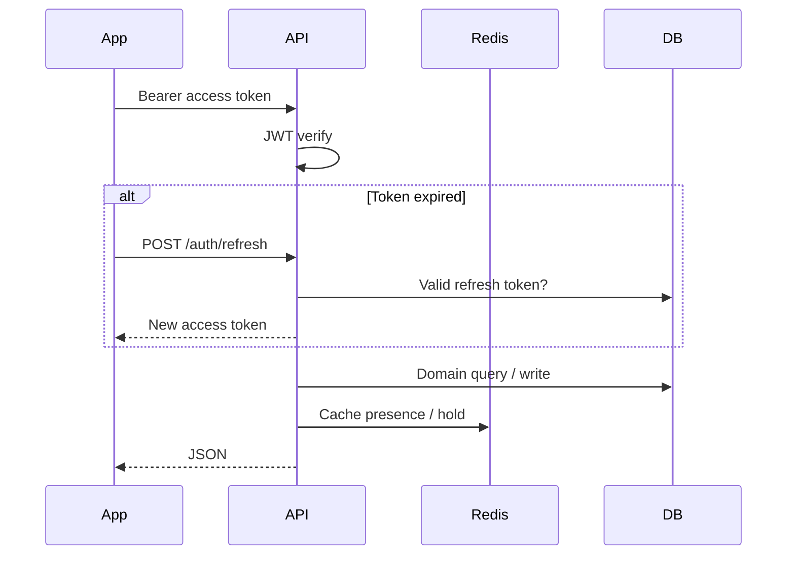
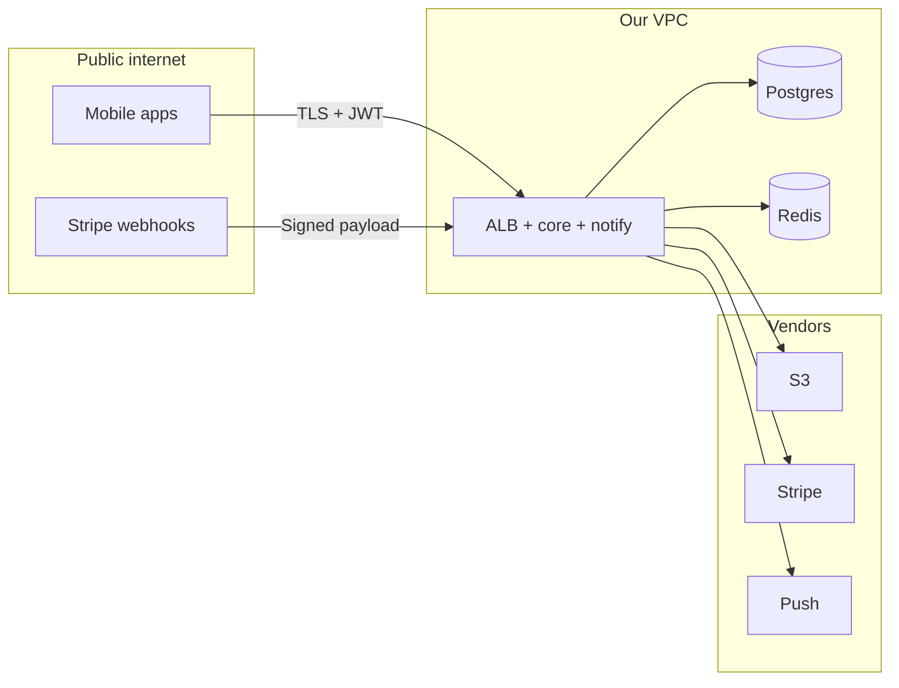

# System architecture

Short client-facing view. Full diagrams: [`10-system-design.md`](10-system-design.md). Locked choices: [`00-decisions.md`](00-decisions.md).

Two mobile apps, **one public API URL**, core + notification service behind a load balancer, one Postgres.

---

## 1. Context — who talks to what

| Actor | Role |
|---|---|
| Client App | Find trainers, book, pay, chat, review |
| Trainer App | Publish slots, accept requests, earn, chat |
| Moveitz API | Auth, matching, bookings, chat, wallet |
| Stripe | Card authorize / capture / refund |
| FCM / APNs | Booking and chat push |
| Object storage | Avatars, gallery, certificates, chat images |

---

## 2. Containers — what we actually run

- **PostgreSQL** — source of truth (users, slots, bookings, chat history, ledger, notification inbox)
- **Redis** — refresh denylist, presence, unread, slot holds, event queue
- **S3** — files only; DB stores URLs
- **Core jobs** — slot hold / session complete / accept timeout (`@nestjs/schedule`)
- **Notify** — push + email; not on the booking HTTP path

---

## 3. Modular monolith — API internals

One deployable. Modules are bounded contexts, not separate services.

---

## 4. Request path

---

## 5. Trust boundaries

Public: `/auth/*`, Stripe webhook. Everything else requires a valid access token and a role check (`CLIENT` vs `TRAINER`).

---

## 6. Environments

| Env | API | DB | Notes |
|---|---|---|---|
| Local | Nginx or `localhost:3000` | Docker Postgres + Redis | Swagger at `/docs`; notify added when split |
| Staging | HTTPS ALB | RDS + Redis | Stripe test keys |
| Production | HTTPS + WSS ALB | RDS + Redis | Stripe live, real push certs |
