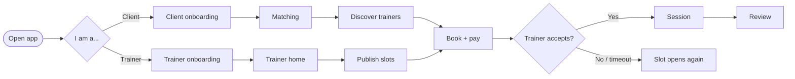
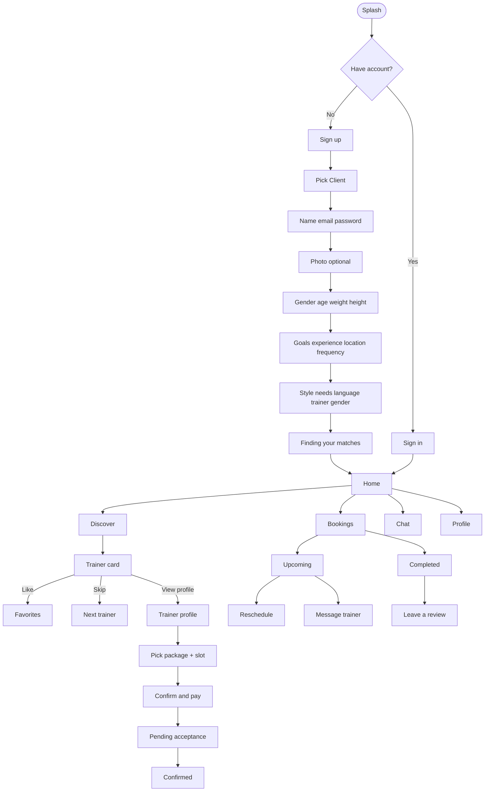
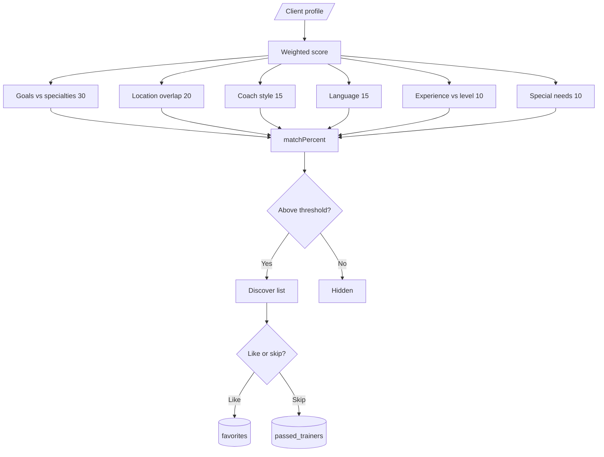
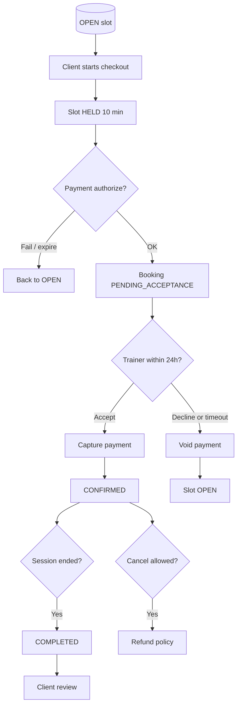
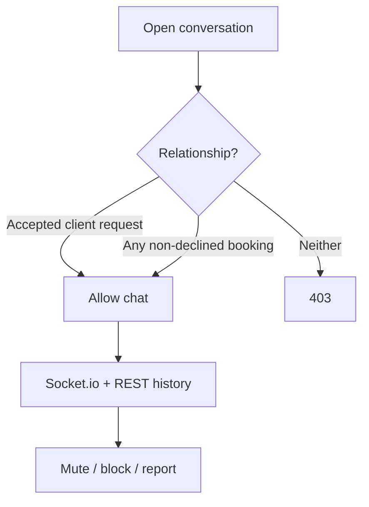

# User flows

End-to-end journeys from the Figma screens. Thick arrows = happy path.

---

## 1. High-level marketplace



---

## 2. Client journey



**Out of MVP (red-X in Figma):** budget screen, “when should training happen”.

---

## 3. Trainer journey

```mermaid
flowchart TD
    splash([Splash]) --> auth{Have account?}
    auth -->|No| signup[Sign up]
    auth -->|Yes| signin[Sign in]
    signup --> role[Pick Trainer]
    role --> account[Name email phone password]
    account --> photo[Photo]
    photo --> spec[Gender specializations experience]
    spec --> ops[Locations capacity rate band]
    ops --> style[Coaching style languages]
    style --> certs[Upload certifications]
    certs --> home[Trainer home]
    signin --> home

    home --> clients[Clients]
    home --> schedule[Schedule]
    home --> chat[Chat]
    home --> profile[Profile]

    home --> stats[Month earnings sessions rating]
    home --> today[Today schedule]
    home --> reqs[New requests Accept / Decline]

    clients --> inbox[Requests New Renew Archive]
    clients --> my[My clients + progress]

    schedule --> week[Week / month calendar]
    week --> add[Add slot wizard]
    add --> pkg[Package type]
    pkg --> price[Price + 10% fee preview]
    price --> when[Date + time]
    when --> svc[In-gym / Online / Client home]
    svc --> open[Slot OPEN]

    profile --> wallet[Wallet pending / available]
```

---

## 4. Client onboarding steps

Saved after each `PATCH /onboarding/client`. Incomplete users can log in but Discover is blocked.

```mermaid
flowchart LR
    s0([Register]) --> s1[Photo]
    s1 --> s2[Gender]
    s2 --> s3[Age]
    s3 --> s4[Weight]
    s4 --> s5[Height]
    s5 --> s6[Goal]
    s6 --> s7[Experience]
    s7 --> s8[Where to train]
    s8 --> s9[Frequency]
    s9 --> s10[Coach style]
    s10 --> s11[Special needs]
    s11 --> s12[Language]
    s12 --> s13[Trainer gender]
    s13 --> s14([Complete])
```



---

## 5. Trainer onboarding steps

```mermaid
flowchart LR
    t0([Register]) --> t1[Photo]
    t1 --> t2[Gender]
    t2 --> t3[Specializations]
    t3 --> t4[Experience]
    t4 --> t5[Locations]
    t5 --> t6[Sessions per week]
    t6 --> t7[Rate band]
    t7 --> t8[Coach style]
    t8 --> t9[Languages]
    t9 --> t10[Certifications]
    t10 --> t11([Complete])
```



---

## 6. Matching

Score 0–100. Discover shows trainers above threshold, sorted by score then distance.



---

## 7. Book a session



---

## 8. Chat access

Chat is not open to strangers.


