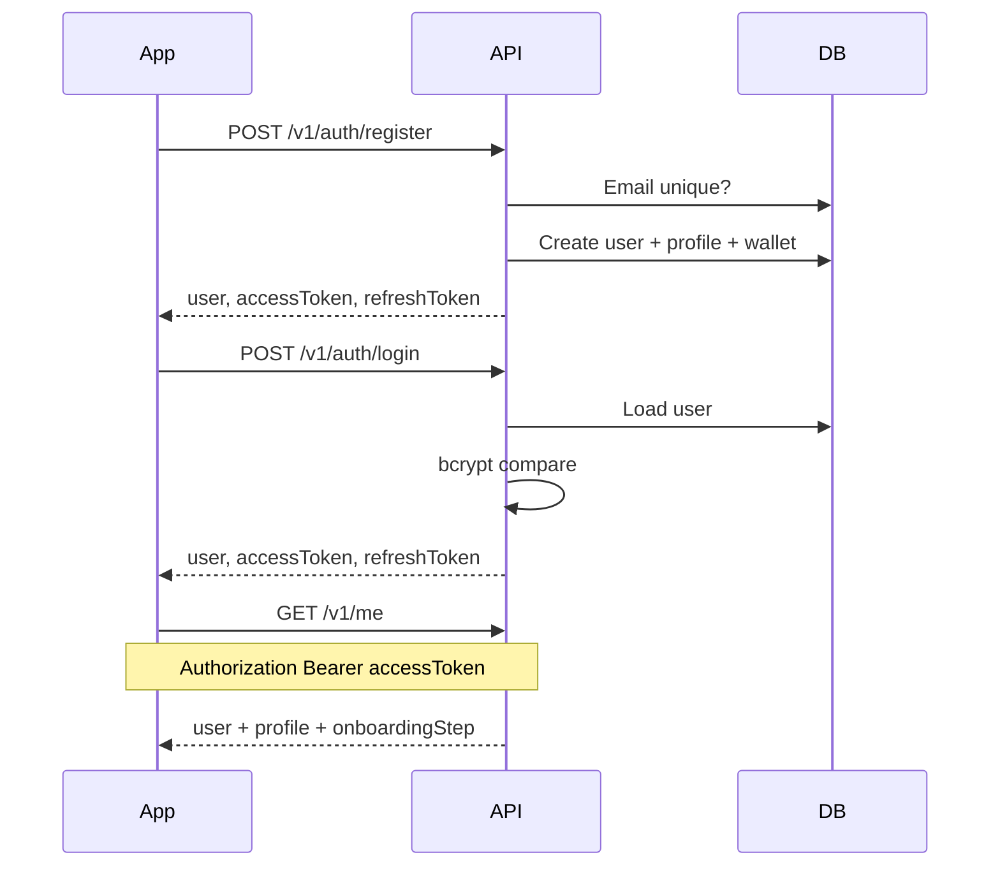
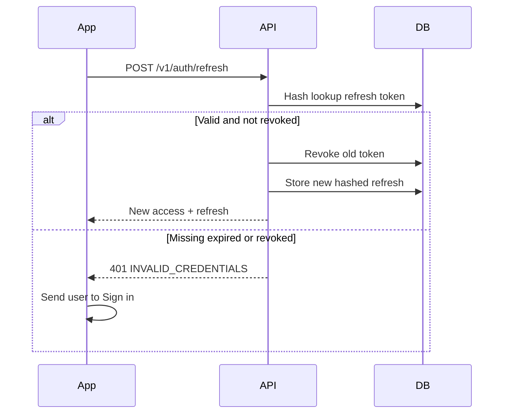
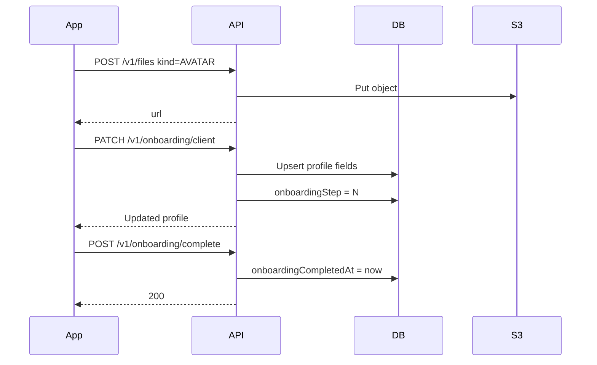
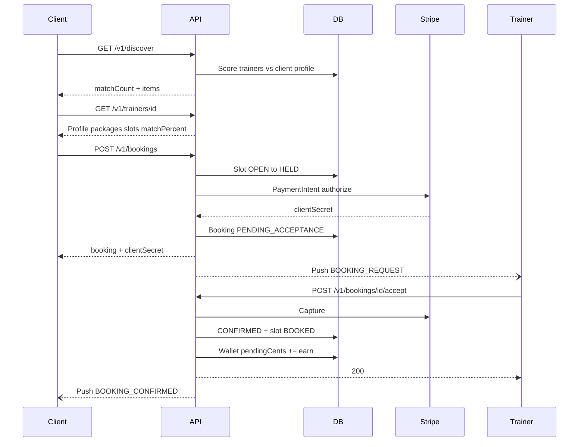
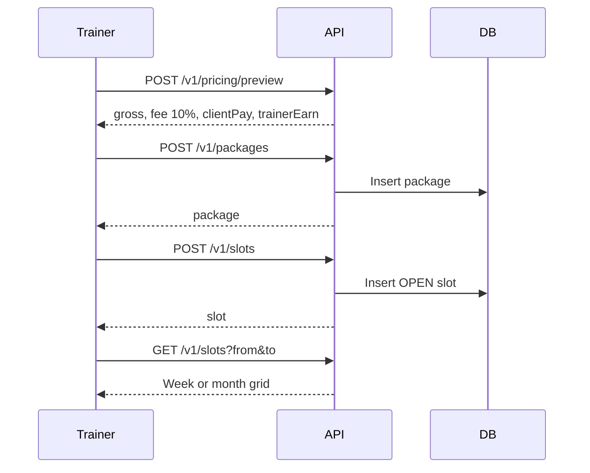
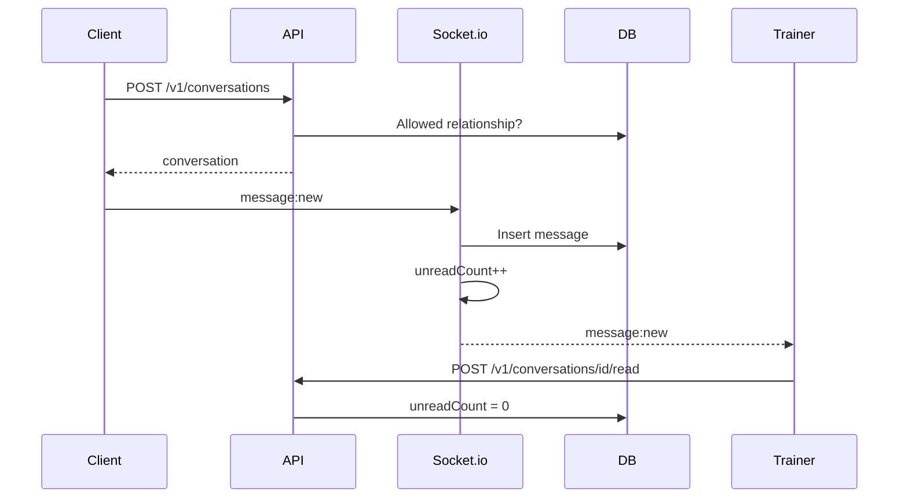
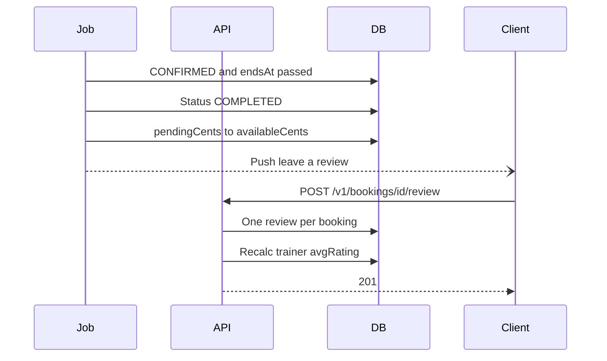
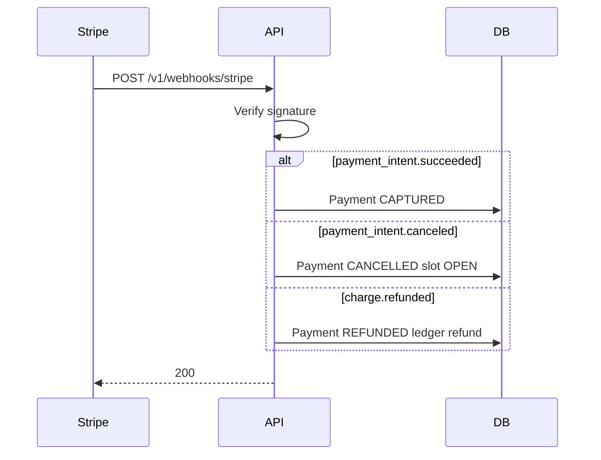

# Sequence diagrams

Time-ordered API calls. These are the contracts mobile should implement against.

---

## 1. Register + login

Access token TTL: 15 minutes. Refresh: 30 days, rotated on each use.

---

## 2. Token refresh

---

## 3. Onboarding save

Trainer path is the same with `PATCH /v1/onboarding/trainer` plus certification uploads (`kind=CERT`).

---

## 4. Discover + book

Decline / 24h timeout voids the PaymentIntent and returns the slot to `OPEN`.

---

## 5. Add slot (trainer)

---

## 6. Chat

Media: `POST /v1/files kind=CHAT` then send `type=IMAGE` with `mediaUrl`.

---

## 7. Review after session

---

## 8. Stripe webhook (source of truth for money)

