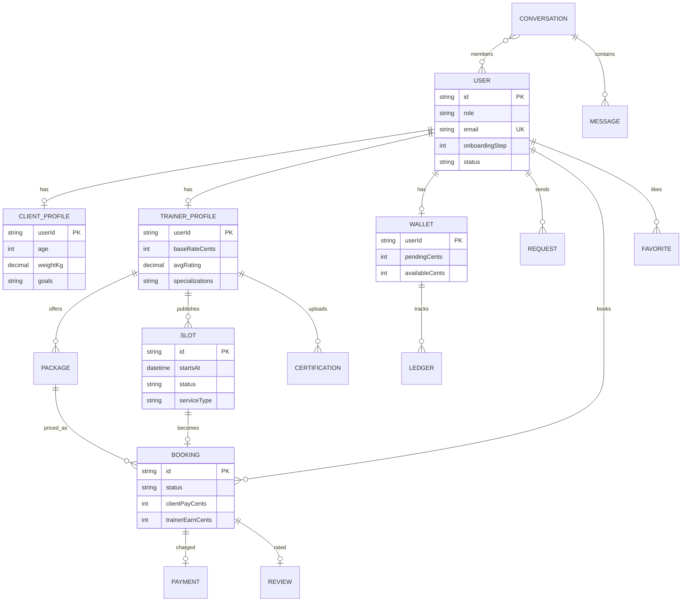
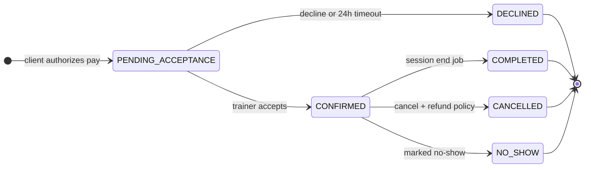
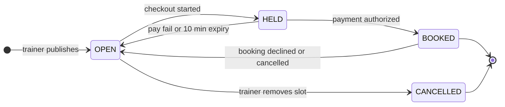
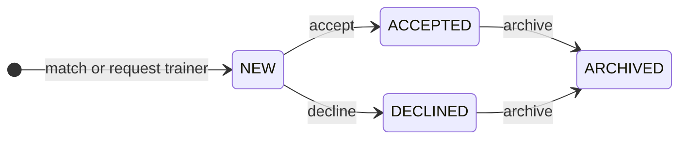
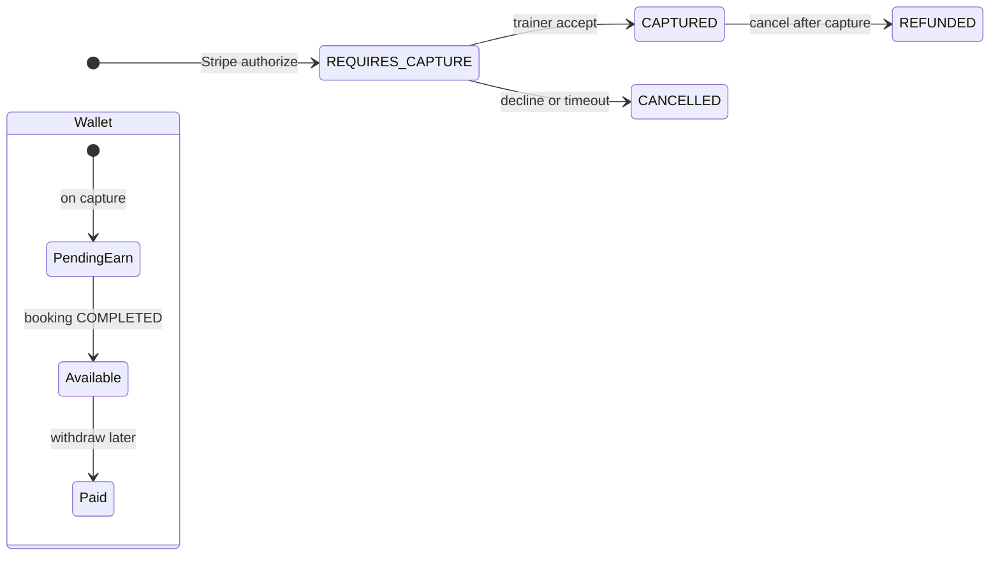
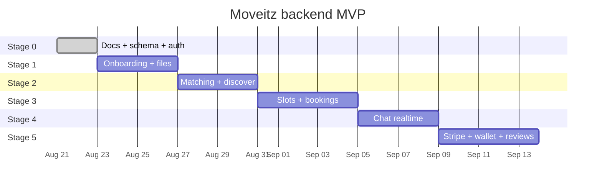

# Domain model and states

Visual companion to `02-er-diagram.md` and `04-state-machines.md`.

---

## 1. Core entities



---

## 2. Booking lifecycle



---

## 3. Slot lifecycle



---

## 4. Client request (trainer inbox)



Filters in UI: All / New / Renew / Archive. `RENEW` = request from a client who already had an accepted relationship.

---

## 5. Money



Fee rule (matches trainer Add-slot UI):

```
gross        = pricePerSession x sessionCount
platformFee  = 10% of gross
clientPay    = gross + platformFee
trainerEarn  = gross - platformFee
```

Amounts stored as **integer cents**. No floats.

---

## 6. Delivery roadmap



Later (not on this chart): Google/Apple login, map search, voice/call, live payouts, Pro Plan.
