# Moveitz — system design

Full design for what we locked in [`00-decisions.md`](00-decisions.md). Product detail lives in `01`–`09`. This file is **how it is built, routed, stored, scaled, tested, and deployed**.

**Shape:** two mobile apps → **one public URL** → load balancer → **core API** (modular monolith) + **notification service** (the only microservice). Auth stays inside core.

**Target:** ~100k registered users (not 100k concurrent). Kubernetes is **not** in this design; the app stays portable (Docker + health + env) if we add it later.

---

## 1. Goals and constraints

| Kind | Requirement |
|---|---|
| Functional | Auth, onboarding, discover/match, calendar slots, booking, chat, Stripe pay, reviews, wallet, notifications |
| Non-functional | HTTPS, JWT, RBAC, ~100k accounts, horizontal scale of **stateless** API, no secrets in git |
| Learn / lab | One real microservice + load balancer + unit/integration + k6 later + AWS (ECS, not K8s) |
| Out | Extra domain services, Mongo, GraphQL, Kafka, OAuth before email, K8s in v1 |

---

## 2. Context (C4 — system)

Who talks to Moveitz. Mobile never calls Stripe, FCM, or the notification process directly.

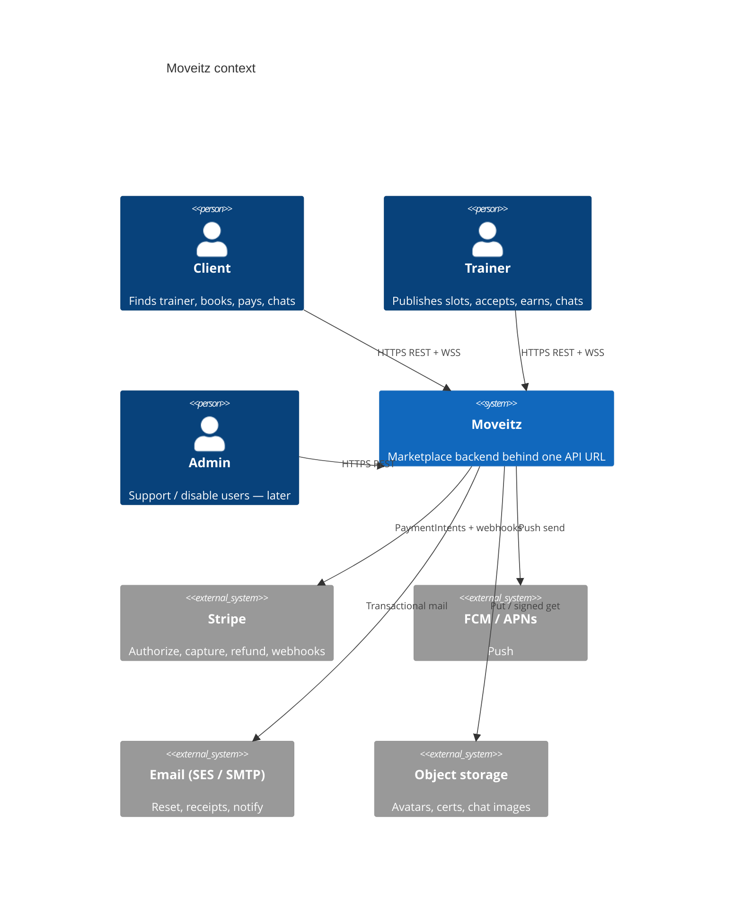

If C4 does not render, equivalent flow:

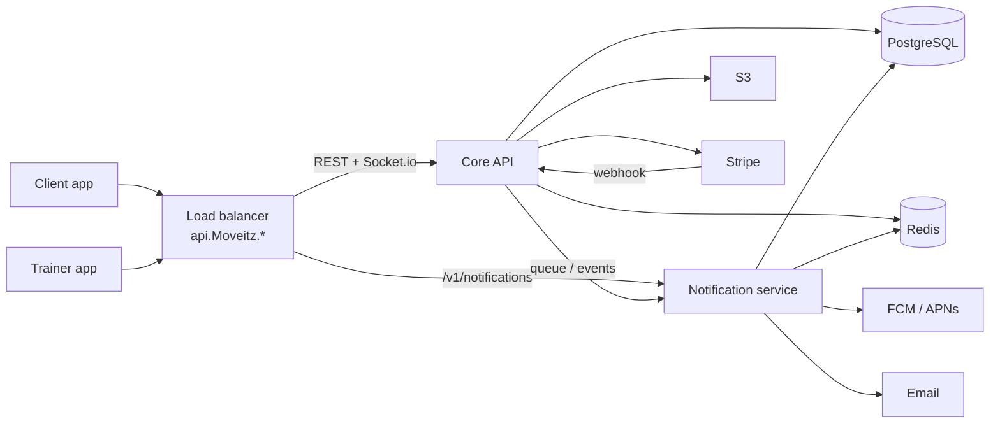

---

## 3. Containers — what we run

### 3.1 Local (Docker Compose)

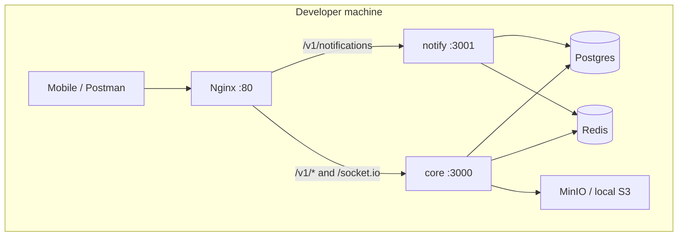

Until the notify service exists, Compose can run **only core + Postgres + Redis**; Nginx is added when we split.

### 3.2 AWS (target)

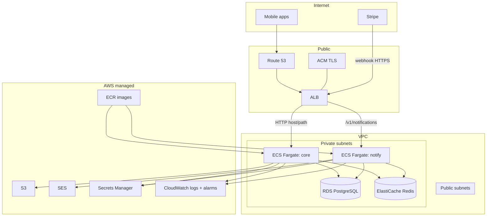

| Piece | Role |
|---|---|
| ALB | TLS terminate, path routing, health checks, later extra core tasks |
| ECS Fargate × 2 | `core`, `notify` — no EC2 to patch |
| RDS Postgres | Source of truth |
| ElastiCache Redis | Holds, denylist, presence, queue (or SQS later) |
| S3 | Files |
| SES | Email |
| Secrets Manager | DB URL, JWT secrets, Stripe keys |
| ECR + GitHub Actions | Build/push/deploy |

**Not in v1:** EKS, NAT-heavy mesh, API Gateway (WebSocket is simpler on ALB → ECS).

---

## 4. Load balancer routing

Mobile uses **one base URL** (e.g. `https://api.Moveitz.example/v1`).

```mermaid
flowchart TB
    REQ[Request]
    REQ --> ALB{ALB / Nginx}

    ALB -->|POST /v1/webhooks/stripe| CORE
    ALB -->|/socket.io| CORE
    ALB -->|/v1/notifications/*| NOTIFY
    ALB -->|/v1/* else| CORE
    ALB -->|/health /ready| same target as path
```

| Path | Target | Auth |
|---|---|---|
| `/v1/auth/*`, `/v1/me`, rest of product API | Core | Public auth routes; else JWT |
| `/v1/notifications` list/read | Notify | JWT (same secret/issuer as core) |
| `/socket.io` | Core | JWT on handshake |
| `/v1/webhooks/stripe` | Core | Stripe signature, no JWT |

Notify **verifies JWT locally** (shared `JWT_ACCESS_SECRET`). It does **not** call core on every request.

WebSocket: ALB **sticky sessions** *or* Socket.io **Redis adapter** (prefer adapter so any core task can own the socket).

---

## 5. Core API — modular monolith

One deployable. Modules = bounded contexts.

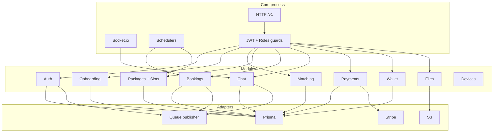

Core **does not send FCM/email** on the request thread. It writes DB + publishes an event (`booking.requested`, `message.created`, …).

---

## 6. Notification microservice

**Owns:** in-app notification rows, push, email, retries, device-token *send*.  
**Does not own:** users, bookings, chat history (reads IDs + copy from the event).

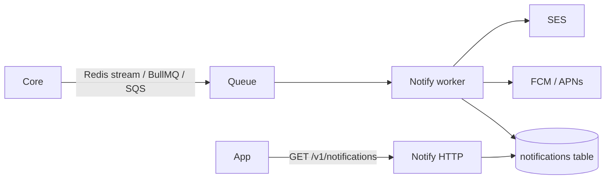

```mermaid
sequenceDiagram
    participant Core
    participant Q as Queue
    participant N as Notify worker
    participant Push as FCM/APNs
    participant App

    Core->>Core: Booking PENDING_ACCEPTANCE
    Core->>Q: booking.requested {userId, bookingId, title}
    Core-->>App: 201 booking (fast)
    Q->>N: Deliver
    N->>N: Insert notification row
    N->>Push: Send
    Note over N,Push: Fail → retry / DLQ; core already succeeded
    App->>N: GET /v1/notifications
    N-->>App: Inbox
```

Failure: notify down → booking still works; pushes delay. That is why this is the service we split.

---

## 7. Data

### 7.1 PostgreSQL (source of truth)

Logical model: [`02-er-diagram.md`](02-er-diagram.md).

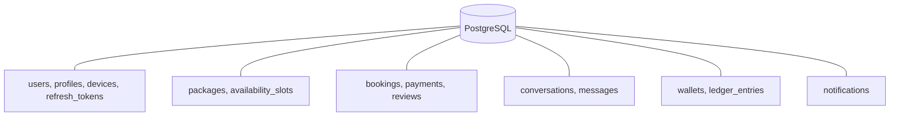

Both services may use the **same RDS instance**. Notify should only **write** `notifications` (and read `devices` for push tokens). No shared Prisma writes into `bookings`.

Indexes that matter at 100k accounts: `users.email`, slots `(trainerId, startsAt)`, bookings `(clientId,status)` / `(trainerId,status)`, messages `(conversationId, createdAt)`, notifications `(userId, createdAt)`.

### 7.2 Redis

| Key / structure | Use |
|---|---|
| Refresh denylist / jti | Logout before access TTL ends |
| `slot:hold:{slotId}` | Checkout hold + TTL |
| Presence | Socket online |
| Unread counters | Chat badge |
| Queue | Events for notify (if not SQS) |
| Socket.io adapter | Multi-task chat |

### 7.3 S3

Objects only. DB stores URL/key. Kinds: `AVATAR`, `GALLERY`, `CERT`, `CHAT`.

---

## 8. Auth (inside core)

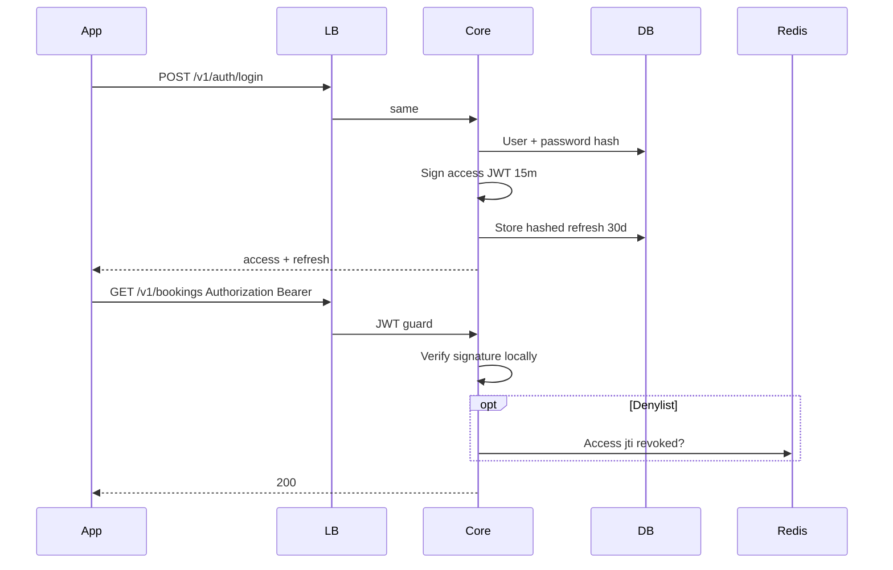

Roles: `CLIENT` | `TRAINER` | `ADMIN`. Guards on every non-public route. Google/Apple: spec only after email.

Notify HTTP uses the **same** access JWT (same secret). No auth service round-trip.

---

## 9. Matching (discover)

Weighted overlap, not ML. Weights in [`00-decisions.md`](00-decisions.md). Runs in core, SQL/Prisma + in-process score. Cache later if hot (`discover:{clientId}` TTL). Distance optional until GPS exists.

---

## 10. Calendar, booking, money

State machines: [`04-state-machines.md`](04-state-machines.md). Sequences: [`08-sequences.md`](08-sequences.md).

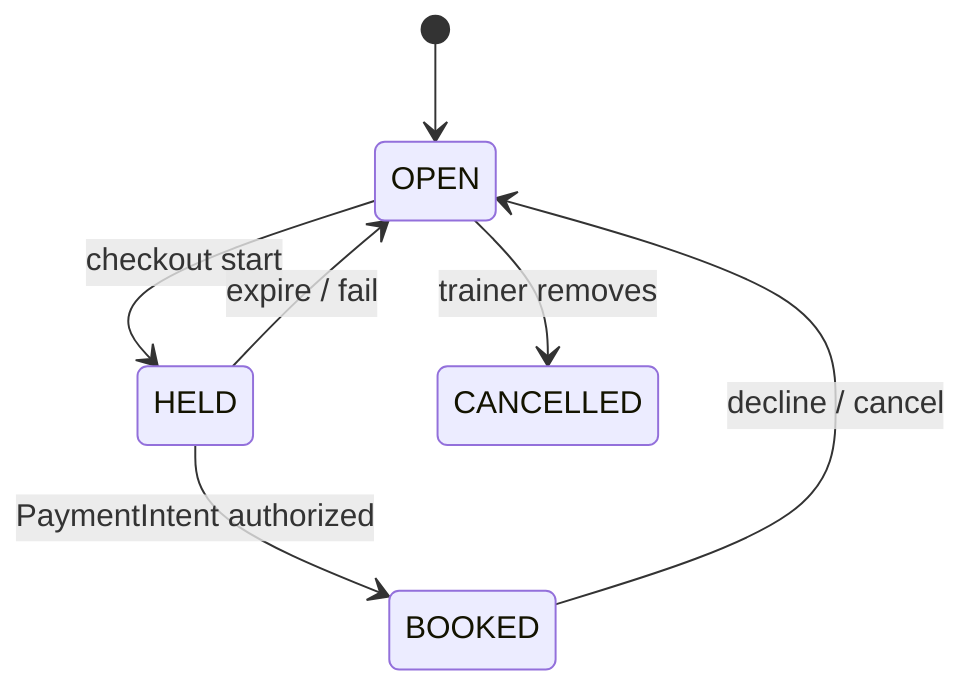

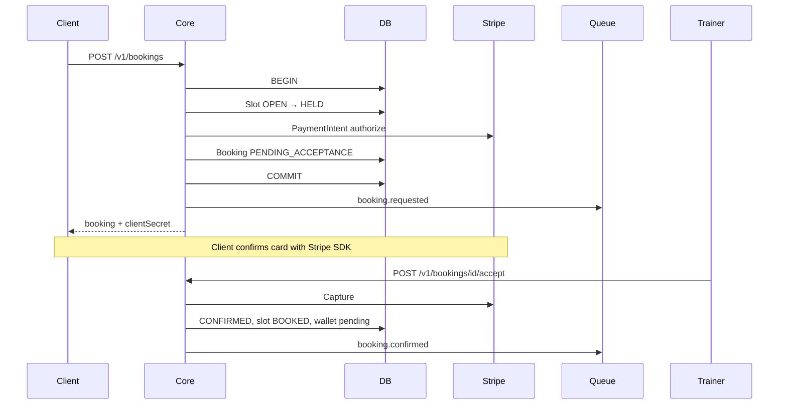

**Concurrency:** one slot, two clients → transaction + row lock (or `UPDATE … WHERE status = OPEN`). Second gets `SLOT_NOT_OPEN`.

**Money:** Stripe webhook is source of truth for capture/cancel/refund. Ledger: pending on accept, **available on COMPLETED**. Fee 10% as in decisions. Connect payouts later; withdraw stub OK.

Idempotency: Stripe `event.id` stored; duplicate webhooks no-op.

---

## 11. Chat

REST for history; Socket.io for live. Same core process.

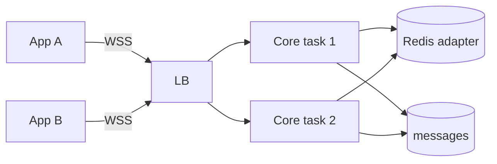

Allowed if accepted request **or** non-declined booking. Events: `message:new`, `message:typing`, `presence:update`. Image: upload file then send URL. On persist → queue `message.created` for push if recipient offline.

---

## 12. Trust, security, public surface

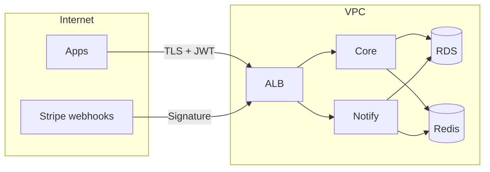

| Rule | How |
|---|---|
| Secrets | Env / Secrets Manager, never git |
| Passwords | bcrypt (or argon2) |
| Refresh | Hashed at rest, rotate on use |
| Webhook | Stripe signature + raw body |
| HTTP | Helmet, CORS allowlist, rate limit |
| Files | Auth + `kind` + size/mime limits |
| PII | UTC in DB; apps convert timezone |

Public: register/login/refresh/forgot-reset, Stripe webhook. Else JWT + role.

---

## 13. Observability and health

| Signal | Design |
|---|---|
| Logs | JSON, `request-id` (ALB/`x-request-id` in, or generate) |
| Metrics later | RPS, latency, 5xx, queue depth, DB connections |
| Trace later | Same `request-id` on core → queue → notify |
| `/health` | Process up (LB liveness) |
| `/ready` | Postgres (+ Redis) reachable |
| Alarms | 5xx, unhealthy ECS, RDS CPU/connections, queue age |

Notify worker failures → retry + dead-letter; do not fail the core HTTP call.

---

## 14. CI / CD

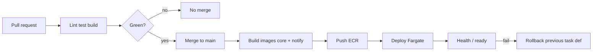

- PR: lint, unit/integration, `nest build`. No heavy k6 on every PR.
- `main` only: images → ECS rolling → health.
- Staging then production when AWS exists.

---

## 15. Testing

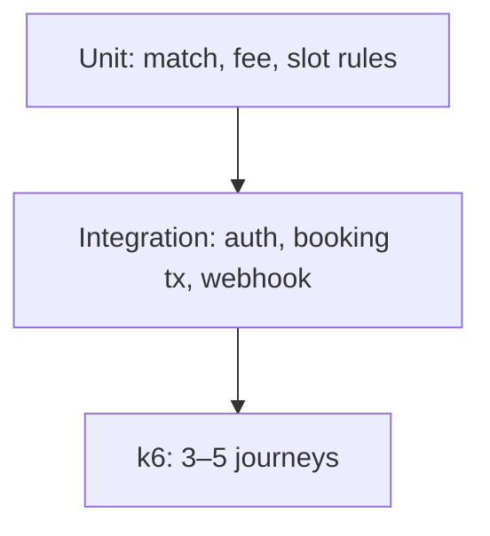

k6 examples (small, after flows exist): login+refresh, discover list, create booking (test Stripe), optional chat connect. Hits **ALB/Nginx**, not K8s.

---

## 16. Capacity (~100k registered)

Assumptions to revisit with k6: DAU ≪ registered; concurrent often hundreds–low thousands, not 100k.

| Layer | How it scales |
|---|---|
| Core | Stateless + JWT → more ECS tasks behind ALB |
| Chat | Redis adapter; connection count is the hot spot |
| Notify | Scale workers independently of HTTP |
| Postgres | Indexes, pooling (Prisma + RDS Proxy later), replica if read-heavy |
| Redis | Holds + presence; eviction policy explicit |
| Slot book | DB lock, not “hope” |

Vertical first (task size / RDS class), then horizontal core + notify. Read replica / partition only after k6 shows a real bottleneck.

---

## 17. Failure modes

| Failure | User sees | Design |
|---|---|---|
| Core down | App down | Multi-AZ later; ALB unhealthy drain |
| Notify down | App works; no push | Queue backs up, worker catch-up |
| Redis down | Holds/presence degrade | Auth refresh still in Postgres; document degraded mode |
| RDS down | App down | Backups; Multi-AZ when prod |
| Stripe down | Bookings cannot pay | Clear error; no fake CONFIRMED |
| One core task dies | Sockets on that task drop | Redis adapter + client reconnect |

---

## 18. Environments

| | Local | Staging | Production |
|---|---|---|---|
| Edge | Nginx or direct `:3000` | ALB + TLS | ALB + TLS + WSS |
| Core / notify | Compose | ECS | ECS |
| DB / Redis | Compose | RDS + ElastiCache small | RDS + ElastiCache sized from k6 |
| Stripe | Test keys | Test | Live |
| Push | Optional log-only | Sandbox certs | Live |

---

## 19. Build vs design (when things appear)

Design is true **now**. Code follows [`00-decisions.md`](00-decisions.md) order: domain in core first (auth already started) → notify extract + Nginx/ALB when there is something to notify → k6 → AWS.

Portable for a future K8s phase: **stateless process, env config, Docker, `/health` `/ready`**. No Kubernetes API in Nest.

---

## 20. Related docs

| Doc | What |
|---|---|
| [00-decisions.md](00-decisions.md) | Locked choices |
| [01-prd-mvp.md](01-prd-mvp.md) | Screens / cut |
| [02-er-diagram.md](02-er-diagram.md) | Tables |
| [04-state-machines.md](04-state-machines.md) | Booking / slot / money |
| [05-api-contract.md](05-api-contract.md) | REST |
| [06-architecture.md](06-architecture.md) | Short client view |
| [07-user-flows.md](07-user-flows.md) | Journeys |
| [08-sequences.md](08-sequences.md) | Time-ordered API |
| [09-domain-states.md](09-domain-states.md) | Visual states / gantt |
